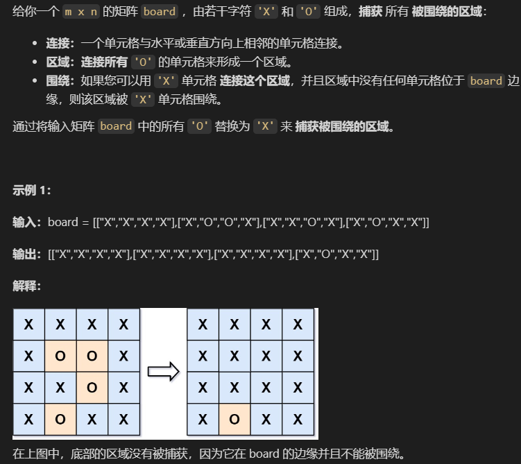

### 128.最长连续序列

给定一个未排序的整数数组 nums ，找出数字连续的最长序列（不要求序列元素在原数组中连续）的长度。

请你设计并实现时间复杂度为 O(n) 的算法解决此问题。

题解
```js
var longestConsecutive = function(nums) {
  if(!nums.length) return 0;
  const map = new Map()
  // 每个整数设为1
  nums.forEach(item => {
    map.set(item, 1)
  })
  // 如果存在比自己小1的数字，说明不是起点，设为0
  nums.forEach(item => {
    if(map.has(item - 1)) {
      map.set(item, 0)
    }
  })
  let maxLength = 1
  nums.forEach(item => {
    if(map.get(item) == 1) {
      let add = 1
      while(map.has(item + add)) {
        add += 1
      }
      maxLength = Math.max(maxLength, add)
    }
  })
  return maxLength
};
```

### 130.被围绕的区域


本题的思路是从边缘不会被包围的区域出发，将可到达的O进行标记，最后再把不可到达的改为X即可

```js
/*
 * @lc app=leetcode.cn id=130 lang=javascript
 *
 * [130] 被围绕的区域
 */

// @lc code=start
/**
 * @param {character[][]} board
 * @return {void} Do not return anything, modify board in-place instead.
 */
var solve = function(board) {
  const m = board.length
  const n = board[0].length
  const border = []

  // 递归将可到达的Z改为O
  function helper(i, j) {
    if(board[i-1]?.[j] == 'Z') {
      board[i-1][j] = 'O'
      helper(i-1, j)
    }
    if(board[i+1]?.[j] == 'Z') {
      board[i+1][j] = 'O'
      helper(i+1, j)
    }
    if(board[i]?.[j-1] == 'Z') {
      board[i][j-1] = 'O'
      helper(i, j-1)
    }
    if(board[i]?.[j+1] == 'Z') {
      board[i][j+1] = 'O'
      helper(i, j+1)
    }
  }
  for(let i = 0; i < m; i++) {
    for(let j = 0; j < n; j++) {
      if((i == 0 || j == 0 || i == m-1 || j == n-1) && board[i][j] == 'O') {
        // 1. 将在边缘且为O的位置保存到border
        border.push([i, j])
        continue
      }
      if((i != 0 || j != 0 || i != m-1 || j != n-1) && board[i][j] == 'O') {
        // 2. 将不在边缘且为O的设为Z
        board[i][j] = 'Z'
      }
    }
  }
  border.forEach(([i, j]) => {
    helper(i, j)
  })

  // 将剩余不可到达的Z设为X
  for(let i = 0; i < m; i++) {
    for(let j = 0; j < n; j++) {
      if(board[i][j] == 'Z') {
        board[i][j] = 'X'
      }
    }
  }
};
// @lc code=end
```

### 134.加油站
在一条环路上有 n 个加油站，其中第 i 个加油站有汽油 `gas[i]` 升。

你有一辆油箱容量无限的的汽车，从第 i 个加油站开往第 i+1 个加油站需要消耗汽油 `cost[i]` 升。你从其中的一个加油站出发，开始时油箱为空。

给定两个整数数组 `gas` 和 `cost` ，如果你可以按顺序绕环路行驶一周，则返回出发时加油站的编号，否则返回 -1 。如果存在解，则 保证 它是 **唯一** 的。

示例：
```
输入: gas = [1,2,3,4,5], cost = [3,4,5,1,2]
输出: 3
解释:
从 3 号加油站(索引为 3 处)出发，可获得 4 升汽油。此时油箱有 = 0 + 4 = 4 升汽油
开往 4 号加油站，此时油箱有 4 - 1 + 5 = 8 升汽油
开往 0 号加油站，此时油箱有 8 - 2 + 1 = 7 升汽油
开往 1 号加油站，此时油箱有 7 - 3 + 2 = 6 升汽油
开往 2 号加油站，此时油箱有 6 - 4 + 3 = 5 升汽油
开往 3 号加油站，你需要消耗 5 升汽油，正好足够你返回到 3 号加油站。
因此，3 可为起始索引。
```

要完成绕行一周满足的条件时 `gas` 的总和要大于 `cost` 的总和，否则就返回-1；

**如何确定起点？**

在遍历过程中先选择一个起点例如 0 ，假设我们走到 3 时发现汽油不足以抵达下一个加油站，那么我们
的下一个起点则是从 4 开始

**为什么是4？**

我们在抵达下一个加油站时剩余的油肯定是大于等于 0 的，拿上例来说我们到达加油站 1 时的油为 `gas[0] - cost[0] + gas[1]`，而 `gas[0] - cost[0] >= 0`，当我们以加油站 1 为起点时油量则为 `gas[1]`，如果以 0 为起点时都无法绕行一周的话，那么以 1 为起点则更不可能，所以在选择下一个可能的起点是不会在上一个起点可通过的范围内的。

题解：
```js
var canCompleteCircuit = function(gas, cost) {
    let totalTank = 0;
    let currentTank = 0;
    let startingStation = 0;
    for (let i = 0; i < gas.length; i++) {
        const netCost = gas[i] - cost[i];
        totalTank += netCost;
        currentTank += netCost;
        if (currentTank < 0) {
            startingStation = i+1;
            currentTank = 0;
        }
    }
    return totalTank < 0 ? -1 : startingStation;
};
```